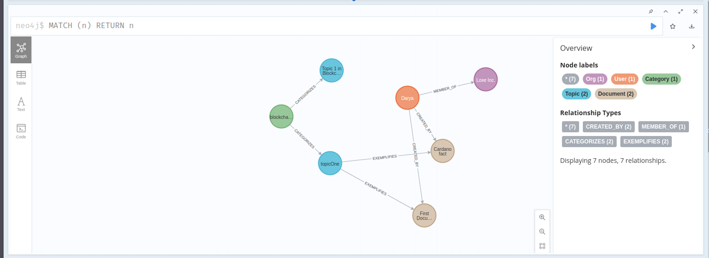

# Fact Check API

## Description

A fact checking API for Cardano where a user can see verified documents and facts about Cardano. Authorized users can create, update, and verify documents. The documents are organized by topic and category.

Using the power of the Neo4j Graph Database, we draw relationships between users and their documents, as well as documents and topics. The fundamental nature of graph databases allows us to find paths between documents across different topics.

## Tech

This API was built with:

- Typescript
- Neo4j & GraphQL
- ApolloServer
- Argon2

## Environment

Make sure you have both environment files:

- .env
- .env-cmdrc.js

And these variables set:

- NEO4J_AUTH=username/password
- NEO4JLABS_PLUGINS=["apoc"]
- NEO4J_PASSWORD=password
- NEO4J_URI=URI for neo4j instance
- NEO4J_USER=neo4j

## How to Use

For development use, use `docker compose up`
For production use, use `npm run start:prod`

## GraphQL Types

- Category
  - mutations:
    - createCategory - see seed/dev (only authorized users, info_creator role)
- Topic
  - mutations:
    - createTopic - see seed/dev (only authorized users, info_creator role)
- Document
  - mutations:
    - createDocument - see seed/dev (only authorized users, info_creator role)
  - queries:
    - documents
- Org
  - mutations:
    - createOrg - see seed/dev (only authorized users, admin role)
- User
  - mutations:
    - CreateUser - see seed/dev
    - Login - see seed/dev
  - queries
    - users
      - id, name, password (only logged in self)

## License

MIT © Loxe Inc.
